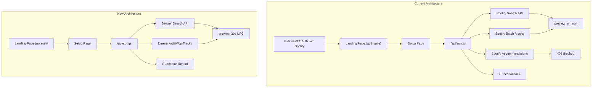

# Phase 1: Deezer Migration + Remove Auth Gate

## Why Spotify Is Broken

Spotify deprecated preview URLs and the Recommendations endpoint for apps in development mode (Nov 2024). Since this app is in dev mode, all preview_url fields return `null` regardless of token type (CC or user OAuth). This is permanent unless the app gets Extended Quota Mode approval from Spotify.

## Architecture Change

## Deezer API Details

- **No auth required** for search and track endpoints
- **30-second previews included** in every track response (`preview` field)
- **Rate limit:** 50 requests per 5 seconds per IP
- **Search endpoint:** `GET https://api.deezer.com/search?q={query}&limit=50&order=RANKING`
- **Artist top tracks:** `GET https://api.deezer.com/artist/{id}/top?limit=50`
- **Artist search:** `GET https://api.deezer.com/search/artist?q={name}`
- **Full song link:** `https://www.deezer.com/track/{track_id}` (opens in Deezer app or web)
- **Track response fields:** `id`, `title`, `artist.name`, `artist.id`, `album.title`, `album.cover_xl`, `preview` (30s MP3 URL), `duration`, `rank`

## Files to Change

### 1. Rename and generalize types - [src/lib/game/types.ts](src/lib/game/types.ts)

- Rename `SpotifyTrack` to `Track` (or `MusicTrack`)
- Change `spotifyUrl` to `songUrl` (generic link)
- Change `uri` to optional or remove (Spotify-specific, not used in game logic)
- Keep all other fields identical

### 2. Rewrite server API - [src/app/api/songs/route.ts](src/app/api/songs/route.ts)

- Replace ALL Spotify API calls with Deezer API calls
- Remove `getClientCredentialsToken` dependency entirely
- Remove `batchFetchSpotifyPreviews` (not needed; Deezer includes preview in search results)
- Remove `fetchRecommendations` (Spotify-only, blocked anyway)
- Map Deezer response to existing track shape:
  - `id` -> track id (Deezer's)
  - `title` -> `name`
  - `artist.name/id` -> `artists`
  - `album.cover_xl` -> `album.images`
  - `preview` -> `previewUrl` (always present)
  - `https://www.deezer.com/track/{id}` -> `songUrl`
- Keep `GENRE_ARTISTS` lists (search by artist name works identically on Deezer)
- Keep `isValidTrack`, `OBSCURE_PATTERNS`, year/era filtering logic
- Keep iTunes as secondary enrichment for any edge cases where Deezer preview is missing
- Respect Deezer rate limits: batch with small delays if needed (50 req/5s)
- Remove `userToken` from request body (no auth needed)

### 3. Rewrite search API - [src/app/api/search/route.ts](src/app/api/search/route.ts)

- Replace Spotify search with `https://api.deezer.com/search?q={query}&limit={limit}`
- No token needed
- Map Deezer response to the same track shape used by GuessInput

### 4. Remove Spotify auth module - [src/lib/spotify/auth.ts](src/lib/spotify/auth.ts)

- Delete this file entirely (OAuth PKCE flow no longer needed)

### 5. Remove client token module - [src/lib/spotify/clientToken.ts](src/lib/spotify/clientToken.ts)

- Delete this file entirely (CC token no longer needed)

### 6. Remove Spotify API helpers - [src/lib/spotify/api.ts](src/lib/spotify/api.ts)

- Delete this file entirely (getCurrentUser, searchTracks no longer needed)

### 7. Rename/clean player module - [src/lib/spotify/player.ts](src/lib/spotify/player.ts)

- Move to `src/lib/audio/player.ts` (it's generic audio, not Spotify-specific)
- Update all imports across the codebase

### 8. Rewrite song pool module - [src/lib/spotify/songPool.ts](src/lib/spotify/songPool.ts)

- Move to `src/lib/music/songPool.ts`
- Remove `getAccessToken` import and all `userToken` references
- Simplify POST body (no `userToken` field)
- Keep `buildQuickSong`, `buildSongPool`, `replenishPool` APIs identical

### 9. Remove landing page auth gate - [src/app/page.tsx](src/app/page.tsx)

- Remove `useSpotifyStore`, `getAccessToken`, `isAuthenticated`, `getCurrentUser` imports
- Remove the `checkAuth` useEffect
- Remove the `SpotifyConnect` component
- Show "START GAME" button immediately (no login required)
- Remove "Powered by Spotify" footer
- Add "Powered by Deezer" or keep it neutral

### 10. Remove Spotify Connect component - [src/components/landing/SpotifyConnect.tsx](src/components/landing/SpotifyConnect.tsx)

- Delete this file entirely

### 11. Remove callback page - [src/app/callback/page.tsx](src/app/callback/page.tsx)

- Delete this page entirely (no OAuth redirect needed)

### 12. Update setup page - [src/app/setup/page.tsx](src/app/setup/page.tsx)

- Remove `isAuthenticated` guard (no auth check needed)
- Remove `getAccessToken` import
- Update imports for renamed song pool module

### 13. Update game page - [src/app/game/page.tsx](src/app/game/page.tsx)

- Update imports for renamed player and song pool modules
- Change `spotifyUrl` to `songUrl` in AlbumReveal prop

### 14. Update AlbumReveal - [src/components/game/AlbumReveal.tsx](src/components/game/AlbumReveal.tsx)

- Rename `spotifyUrl` prop to `songUrl`
- Change "Open in Spotify" button text to "Listen on Deezer"
- Replace Spotify icon SVG with Deezer icon or a generic music icon

### 15. Update GuessInput - [src/components/game/GuessInput.tsx](src/components/game/GuessInput.tsx)

- Update type import from `SpotifyTrack` to `Track`

### 16. Update stores

- [src/store/spotifyStore.ts](src/store/spotifyStore.ts): Delete entirely (no user auth state needed)
- [src/store/gameStore.ts](src/store/gameStore.ts): Update `SpotifyTrack` references to `Track`
- [src/lib/game/engine.ts](src/lib/game/engine.ts): Update `SpotifyTrack` references to `Track`

### 17. Update CSS variables - [src/app/globals.css](src/app/globals.css)

- Remove `--spotify`, `--spotify-dark`, `--spotify-dim` CSS variables (or rename if used)

### 18. Update privacy/terms pages

- [src/app/privacy/page.tsx](src/app/privacy/page.tsx): Update copy to reflect Deezer instead of Spotify

### 19. Clean up environment variables

- Remove `NEXT_PUBLIC_SPOTIFY_CLIENT_ID`, `NEXT_PUBLIC_SPOTIFY_REDIRECT_URI`, `SPOTIFY_CLIENT_SECRET` from `.env.local` and deployment env
- No new env vars needed (Deezer API is public, no key required)

## What Stays the Same

- **Audio player** (`player.ts`): Still uses `HTMLAudioElement` with MP3 URLs (Deezer previews are MP3)
- **Game engine** (`engine.ts`): Track matching, damage, phases, all unchanged (just type rename)
- **Game store**: Same structure, same actions
- **Setup UI**: Genre picker, era picker, team setup, country picker all unchanged
- **Game UI**: SnippetPlayer, DamageOverlay, HpHud, KoScreen all unchanged
- **Song pool logic**: `spaceArtists`, `shuffle`, `buildQuickSong/buildSongPool/replenishPool` APIs identical

## Deezer Search Strategy

Deezer's search supports artist-prefixed queries which map well to the existing approach:

- **By artist:** `GET /search?q=artist:"Queen"&limit=50` (returns top tracks by Queen)
- **Artist + track:** `GET /search?q=artist:"Queen" track:"Bohemian"&limit=50`
- **General:** `GET /search?q=bohemian rhapsody&limit=50`
- **Year filtering:** Deezer doesn't support year in search queries, but returns `release_date` in the track/album response. Filter client-side after fetching.
- **Artist top tracks:** `GET /artist/{id}/top?limit=50` is a better source for popular, well-known songs (replaces the old Recommendations endpoint)

## Risk Mitigation

- **iTunes stays** as a secondary preview fallback in case any Deezer track lacks a preview URL (rare but possible)
- **Track matching** in the game engine uses normalized names, not platform IDs, so switching providers is transparent to gameplay
- Deezer's rate limit (50 req/5s) is generous enough for serverless functions handling one user request at a time; add small delays between batches if parallel requests approach the limit

