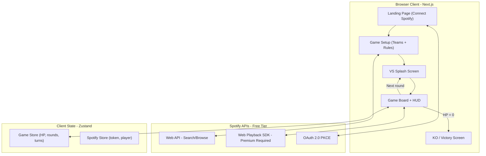
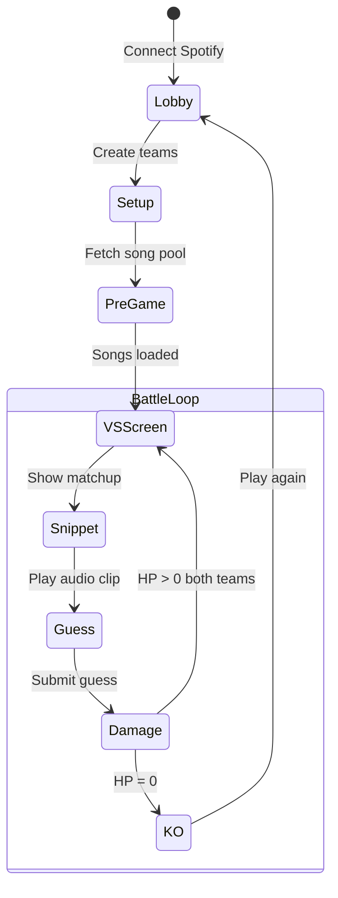

# SoundClash -- Music Guessing Fighting Game

## Concept

Two teams face off in a music knowledge battle. Each team has an HP bar. Teams take turns guessing songs from progressive audio snippets (1s, 3s, 6s...). Slow or wrong guesses drain HP. The team that loses all HP is knocked out. Dark arcade aesthetic -- monochrome UI with album art as the burst of color on each reveal.

## Architecture




## Tech Stack

- **Next.js 14+ (App Router)** + TypeScript -- routing, future API routes for online multiplayer
- **Tailwind CSS + shadcn/ui** -- rapid UI with dark theme
- **Zustand** -- lightweight client state for game + Spotify
- **Spotify Web Playback SDK** -- in-browser audio with `seek()`, `pause()`, `resume()` (requires Premium)
- **Spotify Web API** -- song discovery via Search + Browse endpoints (free with auth token)
- **Spotify OAuth 2.0 PKCE** -- no backend, no client secret, browser-only
- **colorthief** (optional) -- extract dominant color from album art for glow effects

**Cost: $0.** Spotify API is free. No backend for MVP. Deploy on Vercel free tier.

## Game Flow




### Round Detail

1. **VS Screen**: "TEAM ALPHA vs TEAM BETA" -- quick 2-second splash, shows active guesser for each team, current HP bars
2. **Snippet Phase**: Active team's guesser hears the song. Starts at 1s. Play button with a visual countdown ring.
3. **Guess Phase**: Player types guess via Spotify autocomplete. Can guess or skip to hear longer snippet.
4. **Damage Phase**: Calculate HP loss based on snippet level. Animate health bar drain. If correct on 1s, "PERFECT" flash. If wrong, "MISS" with screen shake.
5. **Album Reveal**: Show album cover with dominant-color glow. Song title + artist revealed. Brief pause for dramatic effect.
6. **Alternate**: Other team's turn with a different song.
7. **KO Check**: If either team's HP hits 0, trigger KO screen.

## HP / Damage System (replaces additive scoring)

Starting HP: **100** per team (configurable in setup)

- Correct at 1s: **0 damage** (PERFECT)
- Correct at 3s: **-5 HP**
- Correct at 6s: **-10 HP**
- Correct at 12s: **-15 HP**
- Correct at 20s: **-20 HP**
- Correct at 30s: **-25 HP**
- Wrong guess / skip all: **-30 HP**

**Game feel at these numbers:**

- Worst case (always wrong): ~3-4 turns to KO
- Mediocre play (guessing at 12s): ~7 turns to KO
- Evenly matched (guessing at 3-6s): 15+ rounds, intense back-and-forth
- Configurable: setup screen lets players adjust starting HP and damage scale

Default snippet progression: `[1, 3, 6, 12, 20, 30]` seconds.

## Team Mechanics

- **Two teams**, each with 1+ members (supports 1v1 up to party-sized teams)
- **Shared HP bar** per team -- one weak member hurts the whole team (social pressure, strategy)
- **Member rotation**: Team members rotate as the active guesser each round. e.g., Team of 3: Player A guesses round 1, Player B round 3, Player C round 5, back to A for round 7...
- **Team name + optional avatar**: Chosen during setup

```typescript
// Core types
type Team = {
  id: string;
  name: string;
  members: Player[];
  hp: number;           // starts at config.startingHp
  activeIndex: number;  // which member is guessing next
};

type Player = {
  id: string;
  name: string;
};

type RoundResult = {
  teamId: string;
  playerId: string;
  trackId: string;
  snippetLevel: number;  // index into SNIPPET_DURATIONS
  correct: boolean;
  damage: number;
  albumArt: string;      // URL for the color reveal
};
```

## Visual Design Direction

**Theme: Dark arcade / fighting game**

- **Background**: Near-black (`#0a0a0a`) with subtle noise texture
- **Text**: White and gray (`#fafafa`, `#a1a1aa`), bold sans-serif display font (e.g., Inter or Space Grotesk)
- **Borders/dividers**: Subtle (`#27272a`)
- **Accent colors**: Minimal -- only for HP bar states and interactive elements
- **Album art**: The ONLY source of vibrant color. When revealed, it appears center-stage with a glow halo using the dominant extracted color. The rest of the UI stays monochrome.

**Key UI components:**

- **HP HUD** (top of screen): Two health bars, left and right, fighting-game style. Green -> Yellow -> Red as HP drops. Team names above. Active guesser name below.
- **VS Splash**: Full-screen overlay between rounds. Team names with a diagonal divider. Shows who's up next.
- **Snippet Player**: Central play button with a circular timer that fills as the snippet plays. Pulsing animation while audio is playing.
- **Guess Input**: Dark input field with Spotify autocomplete dropdown. Monochrome until a match is selected.
- **Damage Moment**: On wrong guess: screen flashes red at edges, subtle shake. On perfect: gold flash, "PERFECT" text. On correct but slow: green flash, show damage number floating up.
- **Album Reveal**: Album cover scales up from center, dominant color bleeds into a soft glow behind it. Song title and artist fade in below.
- **KO Screen**: Losing team's HP bar shatters/explodes. "K.O." text, winner announcement, album art collage from the match.

## Song Discovery Strategy

Two approaches combined:

1. **Curated playlists** (primary): `GET /v1/browse/categories/{genre}/playlists` then fetch tracks. Spotify-curated = recognizable songs, critical for a guessing game.
2. **Search API** (supplement): `GET /v1/search?q=genre:rock year:1980-1989&type=track&market=US` for targeted era/country filtering.

Pre-fetch ~50-100 tracks at game start. Shuffle. Draw from pool each round. No API calls during gameplay.

## Guess Mechanic

- **Autocomplete** powered by Spotify Search API (`GET /v1/search?q={input}&type=track&limit=5`)
- Player types a few characters, sees matching song+artist suggestions
- Select a result to lock in guess. Compare by track ID for correctness.
- "Skip" button to hear next snippet without guessing (still counts as damage at that level if they eventually get it wrong)
- Debounced search (300ms) to avoid API spam

## Project Structure

```
src/
  app/
    page.tsx                     # Landing + "Connect with Spotify"
    callback/page.tsx            # OAuth redirect handler
    setup/page.tsx               # Team + rules setup
    game/page.tsx                # Main game board
    layout.tsx                   # Root layout, dark theme, font loading
  components/
    landing/
      SpotifyConnect.tsx         # Auth button, connection status
      HeroSection.tsx            # Game title, tagline, vibe
    setup/
      TeamSetup.tsx              # Two team panels, add/remove members
      GenrePicker.tsx            # Multi-select genre chips
      EraPicker.tsx              # Decade selector buttons
      CountryPicker.tsx          # Market/country dropdown
      GameConfig.tsx             # Starting HP, damage scale, snippet durations
    game/
      HpBar.tsx                  # Animated health bar with color transitions
      HpHud.tsx                  # Top bar: both teams' HP + active guesser
      VsSplash.tsx               # Full-screen VS overlay between rounds
      SnippetPlayer.tsx          # Play button + circular timer ring
      GuessInput.tsx             # Autocomplete search with Spotify results
      DamageOverlay.tsx          # Screen flash / shake on damage
      AlbumReveal.tsx            # Album art + dominant color glow reveal
      KoScreen.tsx               # KO animation + winner
    shared/
      Button.tsx                 # Styled button (shadcn)
      Input.tsx                  # Styled input (shadcn)
  lib/
    spotify/
      auth.ts                   # PKCE: generateCodeVerifier, exchangeToken, refreshToken
      api.ts                    # searchTracks, getPlaylistTracks, browseCategories
      player.ts                 # SDK init, playSnippet(uri, durationMs), stop
      songPool.ts               # Fetch + filter + shuffle songs from config
    game/
      engine.ts                 # State machine: VS_SCREEN -> SNIPPET -> GUESS -> DAMAGE -> ROUND_END -> KO
      damage.ts                 # calculateDamage(snippetLevel, correct): number
      types.ts                  # Team, Player, RoundResult, GameConfig, GamePhase
      constants.ts              # SNIPPET_DURATIONS, DAMAGE_TABLE, DEFAULT_HP, GENRES, ERAS
    utils/
      colorExtract.ts           # Extract dominant color from album art image
  store/
    gameStore.ts                # Zustand: teams, rounds, currentPhase, config
    spotifyStore.ts             # Zustand: token, player instance, isReady
```

## Extensibility for Future Phases

**Online Multiplayer (Phase 2)**:

- Add Next.js API routes + WebSocket (Socket.io) for real-time sync
- Game state moves to server; clients receive state diffs
- Room codes for joining games
- Each player connects their own Spotify (host's account plays audio, others see UI only -- OR each client plays locally)

**Card Mechanics (Phase 3)**:

- `Card` type with `effect: 'genreOverride' | 'timeBonus' | 'heal' | 'doubleDamage' | 'shield'`
- Cards integrate naturally with HP: heal = restore HP, shield = block damage this round, doubleDamage = opponent takes 2x
- "Genre Override": force opponent to guess a country song (sabotage)
- "+5s Booster": add 5 bonus seconds to your snippet (mercy)
- "Double or Nothing": 0 damage if correct, 2x damage if wrong
- Cards drawn from a deck at game start, played before/during rounds
- Engine state machine already has phases -- cards are phase modifiers

## Spotify Developer Setup (Prerequisite)

1. Go to [developer.spotify.com/dashboard](https://developer.spotify.com/dashboard)
2. Create a new app, get **Client ID** (free, no cost)
3. Add redirect URI: `http://localhost:3000/callback` (dev) + production URL later
4. Required scopes: `streaming`, `user-read-email`, `user-read-private`
5. Enable Web Playback SDK in app settings

