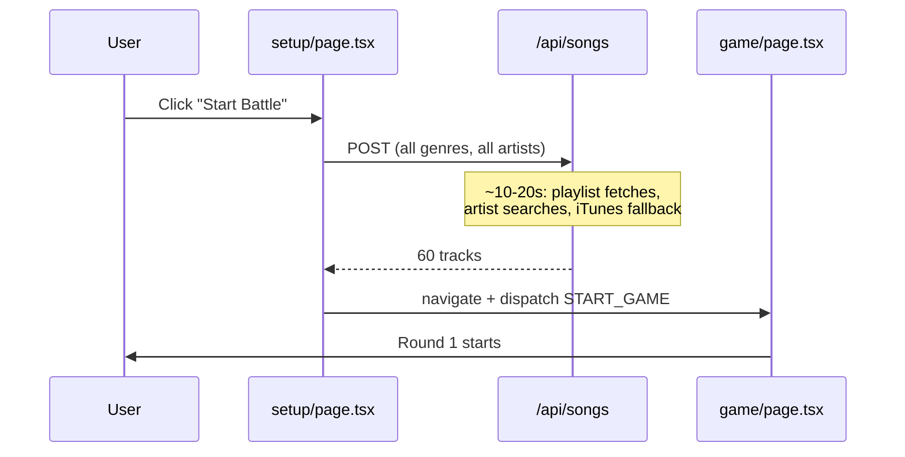
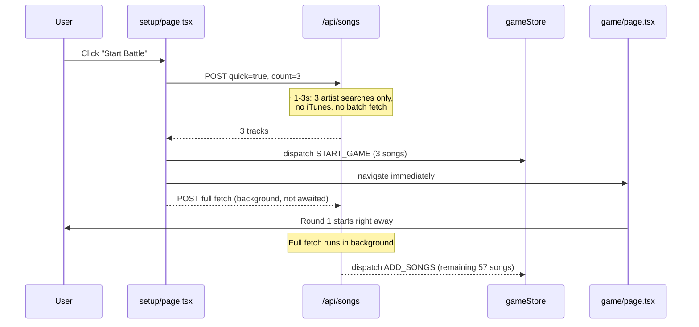

# Progressive Song Pool Loading

## Current flow (slow)




## New flow (fast)




## Changes

### 1. `[src/app/api/songs/route.ts](src/app/api/songs/route.ts)`

Add `quick: boolean` and `quickCount: number` to the request body. When `quick: true`:

- Skip era playlist fetches entirely
- Search only 3 random artists per genre (instead of all ~15-20)
- Use only `preview_url` already in search results (skip user-token batch fetch and iTunes fallback)
- Return as soon as `quickCount` tracks with a preview URL are found

```ts
// New request shape
const { genres, eras, market, userToken, quick, quickCount } = await request.json();

if (quick) {
  // search 3 random artists, return first quickCount tracks with preview_url
  const artists = shuffle(GENRE_ARTISTS[genres[0]] ?? []).slice(0, 3);
  // ... search + filter for preview_url, return early
  return NextResponse.json({ tracks: result.slice(0, quickCount) });
}
// existing full-pool logic below ...
```

### 2. `[src/lib/spotify/songPool.ts](src/lib/spotify/songPool.ts)`

Add a `buildQuickSong(config)` function alongside the existing `buildSongPool`:

```ts
export async function buildQuickSong(config: GameConfig, count = 3): Promise<SpotifyTrack[]> {
  const userToken = await getAccessToken().catch(() => null);
  const resp = await fetch("/api/songs", {
    method: "POST",
    headers: { "Content-Type": "application/json" },
    body: JSON.stringify({ ...config, userToken, quick: true, quickCount: count }),
  });
  // ... same mapping logic as buildSongPool
}
```

### 3. `[src/lib/game/engine.ts](src/lib/game/engine.ts)`

Add `ADD_SONGS` to `GameAction` and handle it in the reducer:

```ts
// In GameAction union:
| { type: "ADD_SONGS"; songs: SpotifyTrack[] }

// In reducer:
case "ADD_SONGS":
  return { ...state, songPool: [...state.songPool, ...action.songs] };
```

### 4. `[src/app/setup/page.tsx](src/app/setup/page.tsx)`

Refactor `handleStartBattle` to two-phase fetch:

```ts
const handleStartBattle = async () => {
  setLoading(true);
  setError(null);
  try {
    // Phase 1: fast fetch — 1-3s
    const quickSongs = await buildQuickSong(config, 3);
    if (quickSongs.length === 0) {
      setError("Couldn't load any songs. Try different genres.");
      setLoading(false);
      return;
    }
    dispatch({ type: "START_GAME", songPool: quickSongs });
    router.push("/game");

    // Phase 2: background full fetch (fire and forget after navigate)
    buildSongPool(config, 60)
      .then((songs) => {
        const alreadyIn = new Set(quickSongs.map(s => s.id));
        const newSongs = songs.filter(s => !alreadyIn.has(s.id));
        if (newSongs.length > 0) {
          useGameStore.getState().dispatch({ type: "ADD_SONGS", songs: newSongs });
        }
      })
      .catch((err) => console.warn("[Setup] Background pool fetch failed:", err));
  } catch (err) {
    // ... existing error handling
  }
};
```

## Edge cases handled

- If background fetch fails: game continues with the initial 3 songs, existing "No more songs" fallback handles pool exhaustion gracefully
- Duplicate prevention: `alreadyIn` set filters out IDs already in the quick result
- Quick fetch returns 0: show error before navigating, same as current behavior
- The loading spinner text can change to "Getting ready..." during the fast fetch so it still feels responsive

