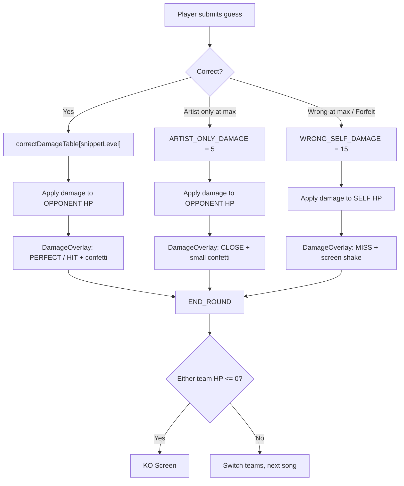

# Reverse Damage Mechanic

## Current Behavior

Every outcome hurts the **guessing team**:

- Correct at snippet 0 (1s): 0 damage to self ("PERFECT")
- Correct at snippet 5 (30s): 25 damage to self
- Wrong / forfeit: 30 damage to self

The opponent is never affected. This feels backwards — guessing correctly should reward you, not just hurt you less.

## New Behavior

| Outcome | Who takes damage | Amount | Label |
| ------- | ---------------- | ------ | ----- |

**Correct guess (hits opponent):**

- Snippet 0 (1s): **25 HP** to opponent ("PERFECT")
- Snippet 1 (3s): **20 HP** to opponent
- Snippet 2 (6s): **15 HP** to opponent
- Snippet 3 (12s): **10 HP** to opponent
- Snippet 4 (20s): **5 HP** to opponent
- Snippet 5 (30s): **3 HP** to opponent

**Artist-only at max snippet:** **5 HP** to opponent (partial hit)

**Wrong at max snippet / Skip all / Give up:** **15 HP** to self (self-damage)

### HP Economics Rationale

With 100 HP starting, it takes:

- 4 perfect guesses (25 each) to KO an opponent
- 10 late-but-correct guesses (10 each) to KO
- ~7 misses (15 each) to KO yourself
- A mix of offense and defense creates natural tension

Self-damage for wrong answers is set to 15 (not 30) because now a correct guess also advances your position offensively. Having both offense and defense in play makes games faster and more exciting.

## Files to Change

### 1. [src/lib/game/constants.ts](src/lib/game/constants.ts) — New damage tables

Replace `DEFAULT_DAMAGE_TABLE` with two separate tables:

- `CORRECT_DAMAGE_TABLE = [25, 20, 15, 10, 5, 3]` (opponent damage, indexed by snippet level)
- `WRONG_SELF_DAMAGE = 15` (flat self-damage for miss/forfeit)
- `ARTIST_ONLY_DAMAGE = 5` (moved here, opponent damage for partial match)

### 2. [src/lib/game/types.ts](src/lib/game/types.ts) — Track who got hit

Add `targetTeamId: string` to `RoundResult` so the KO screen and battle summary can show which team was damaged. Update `GameConfig.damageTable` to `correctDamageTable` and add `wrongSelfDamage`.

### 3. [src/lib/game/damage.ts](src/lib/game/damage.ts) — New calculation

Return a `{ damage: number, targetSelf: boolean }` object instead of a bare number. `getDamageLabel` updated so that on correct guesses, high damage is "PERFECT" (not zero damage).

### 4. [src/lib/game/engine.ts](src/lib/game/engine.ts) — Core logic change

This is the main change. In `SUBMIT_GUESS`, `SKIP_GUESS`, and `GIVE_UP`:

- **Correct:** apply `CORRECT_DAMAGE_TABLE[snippetLevel]` to `teams[opponentIndex]`
- **Artist-only at max:** apply `ARTIST_ONLY_DAMAGE` to `teams[opponentIndex]`
- **Wrong at max / Skip all / Give up:** apply `WRONG_SELF_DAMAGE` to `teams[currentTeamIndex]`

KO check in `END_ROUND` must check **both** teams' HP (not just the guessing team), since either team could now reach 0.

### 5. [src/components/game/DamageOverlay.tsx](src/components/game/DamageOverlay.tsx) — Visual feedback

Update to show context-appropriate feedback:

- Correct guess: confetti + "PERFECT" / "HIT" / "CLOSE" with "{opponent name} takes -{X} HP"
- Wrong / forfeit: screen shake + "MISS" with "You take -{X} HP"

### 6. [src/components/game/KoScreen.tsx](src/components/game/KoScreen.tsx) — Battle summary

Minor update: round results now have `targetTeamId` so the summary can show "dealt 15 damage to {opponent}" vs "took 15 self-damage" per round.

### 7. [src/app/game/page.tsx](src/app/game/page.tsx) — Pass team context to overlay

Pass the target team name to `DamageOverlay` so it can display who got hit.

## Data Flow (New)

